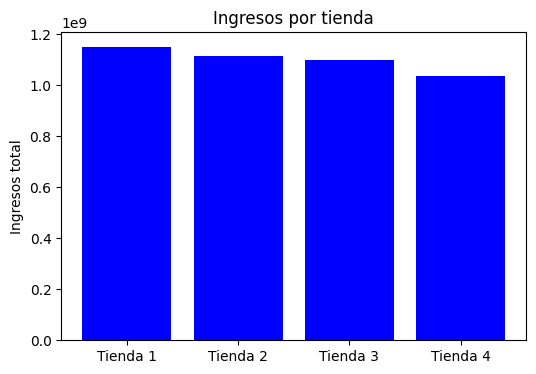
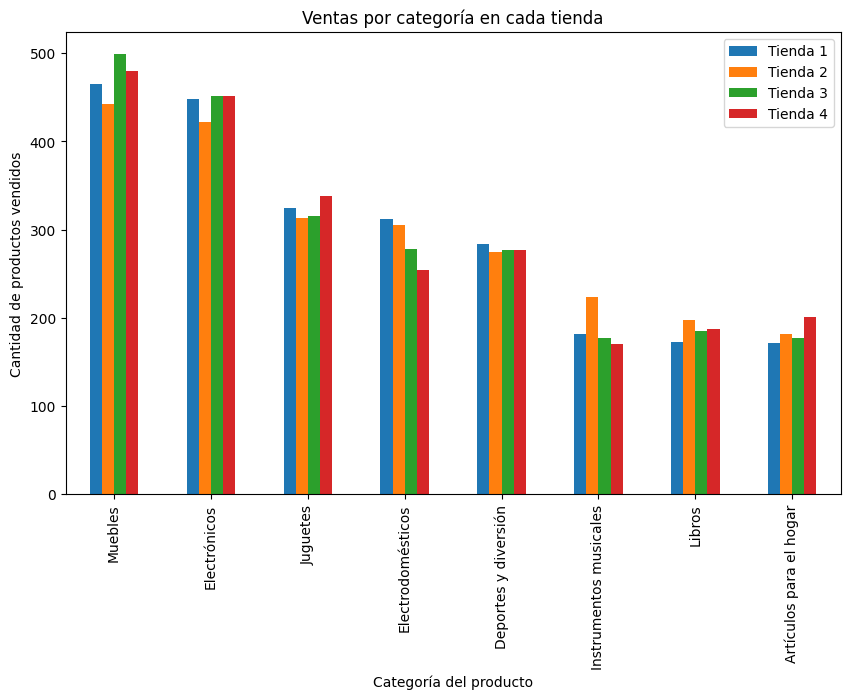
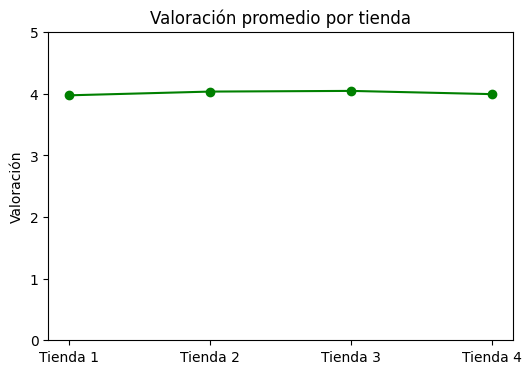

## Propósito del análisis

El objetivo de este proyecto es realizar un:**análisis integral de ventas** de varias tiendas, explorando aspectos clave como:  

- Las **categorías de productos más vendidas**.  
- La **valoración promedio de los clientes** por tienda.  
- Los **productos más y menos vendidos**.  
- El **costo promedio de envío** por tienda.  

Este análisis permite **identificar patrones de ventas y preferencias de los clientes **, facilitando la toma de decisiones estratégicas para cada tienda.

---

## Estructura del proyecto

El proyecto está organizado de la siguiente manera:
- La carpeta **`/graficos`** contiene los gráficos generados durante el análisis.  
- El archivo **`AluraStoreLatam.ipynb`** contiene donde se realiza el análisis y se generan los gráficoss.  

---

## Ejemplos de gráficos e insights obtenidos

1.**Ingresos por tienda**
  Graficos de barras mostrando el ingreso por tienda

   

2. **Ventas por categoría**  
   Gráfico de barras mostrando cuáles son las categorías más populares en cada tienda.  

   

3. **Valoración media por tienda**  
   Permite identificar qué tiendas tienen la mayor satisfacción de clientes.  

   

**Insights generales:**  
- Algunas tiendas dominan ciertas categorías específicas.  
- La satisfacción del cliente puede correlacionarse con productos más vendidos.  

---

## Instrucciones para ejecutar el archivo

1. Abrir **`analisis_ventas.ipynb`** en **Colab** .  
2. Cargar los archivos de datos de ventas en el entorno.  
3. Ejecutar las celdas de análisis en orden para reproducir los resultados y gráficos.  

---

